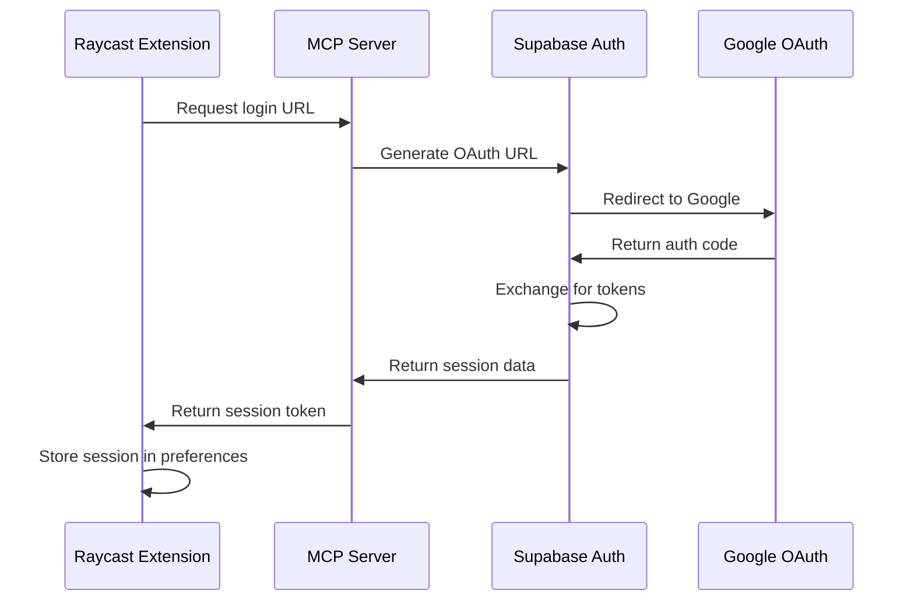

# Design Document - User Authentication

## Overview

This document outlines the technical design for implementing Google OAuth authentication in PromptBoard using Supabase Auth. The solution integrates seamlessly with the existing Raycast extension, MCP server, and Supabase database architecture while adding secure user authentication and team-based access control.

## Architecture

### High-Level Architecture

```
Raycast Extension ↔ MCP Server (Vercel) ↔ Supabase (Database + Auth)
                                ↓
                         Supabase Auth ↔ Google OAuth
```

### Authentication Flow



## Components and Interfaces

### 1. Raycast Extension Updates

#### Authentication State Management
- **Location**: `src/lib/auth.ts`
- **Purpose**: Manage authentication state and session persistence
- **Key Functions**:
  - `getStoredSession()`: Retrieve session from Raycast preferences
  - `storeSession(session)`: Store session data securely
  - `clearSession()`: Remove stored session data
  - `isAuthenticated()`: Check if user is currently authenticated

#### Login Command
- **Location**: `src/login.tsx`
- **Purpose**: Handle user authentication flow
- **Features**:
  - Display Google login button
  - Handle OAuth callback
  - Show authentication status

#### Authentication Hook
- **Location**: `src/hooks/useAuth.ts`
- **Purpose**: Provide authentication state to all commands
- **Returns**: `{ user, isLoading, login, logout, isAuthenticated }`

### 2. MCP Server Authentication Endpoints

#### Authentication Routes
- **Location**: `mcp-server/api/auth.ts`
- **Endpoints**:
  - `GET /auth/login`: Generate Google OAuth URL
  - `POST /auth/callback`: Handle OAuth callback and create session
  - `POST /auth/logout`: Invalidate session
  - `GET /auth/user`: Get current user profile

#### Session Middleware
- **Location**: `mcp-server/lib/auth-middleware.ts`
- **Purpose**: Validate sessions for protected routes
- **Features**:
  - Extract and validate Supabase JWT tokens
  - Attach user context to requests
  - Handle token refresh

### 3. Supabase Configuration

#### Auth Provider Setup
- Enable Google OAuth provider in Supabase dashboard
- Configure redirect URLs for development and production
- Set up custom claims for team membership

#### Row Level Security Policies
- Update existing policies to use authenticated user ID
- Implement team-based access control
- Ensure data isolation between users/teams

## Data Models

### Updated Database Schema

#### Users Table (Managed by Supabase Auth)
```sql
-- Supabase auth.users table (built-in)
-- Contains: id, email, user_metadata, created_at, etc.
```

#### User Profiles Table
```sql
CREATE TABLE user_profiles (
  id UUID PRIMARY KEY REFERENCES auth.users(id) ON DELETE CASCADE,
  display_name TEXT NOT NULL,
  avatar_url TEXT,
  team_id UUID REFERENCES teams(id),
  created_at TIMESTAMPTZ DEFAULT NOW(),
  updated_at TIMESTAMPTZ DEFAULT NOW()
);
```

#### Teams Table
```sql
CREATE TABLE teams (
  id UUID PRIMARY KEY DEFAULT uuid_generate_v4(),
  name TEXT NOT NULL,
  domain TEXT, -- For email domain-based team assignment
  created_at TIMESTAMPTZ DEFAULT NOW()
);
```

#### Updated Prompts Table
```sql
ALTER TABLE prompts 
ADD COLUMN user_id UUID REFERENCES auth.users(id) ON DELETE CASCADE,
ADD COLUMN team_id UUID REFERENCES teams(id),
ADD COLUMN is_public BOOLEAN DEFAULT false;

-- Update existing prompts to have a default user
UPDATE prompts SET user_id = (SELECT id FROM auth.users LIMIT 1) WHERE user_id IS NULL;
```

#### Updated History Table
```sql
ALTER TABLE history 
ADD COLUMN user_id UUID REFERENCES auth.users(id) ON DELETE CASCADE;
```

### Row Level Security Policies

#### Prompts RLS Policies
```sql
-- Users can read public prompts or prompts in their team
CREATE POLICY "Users can read accessible prompts" ON prompts
  FOR SELECT USING (
    is_public = true OR 
    user_id = auth.uid() OR 
    team_id IN (SELECT team_id FROM user_profiles WHERE id = auth.uid())
  );

-- Users can insert prompts for themselves
CREATE POLICY "Users can create prompts" ON prompts
  FOR INSERT WITH CHECK (user_id = auth.uid());

-- Users can update their own prompts
CREATE POLICY "Users can update own prompts" ON prompts
  FOR UPDATE USING (user_id = auth.uid());
```

## Error Handling

### Authentication Errors
- **Invalid Session**: Redirect to login with clear error message
- **OAuth Failure**: Display user-friendly error and retry option
- **Network Issues**: Implement retry logic with exponential backoff
- **Token Expiry**: Automatic refresh or re-authentication prompt

### Authorization Errors
- **Insufficient Permissions**: Clear messaging about access restrictions
- **Team Access Denied**: Explain team-based access model
- **Resource Not Found**: Distinguish between non-existent and unauthorized

### Error Response Format
```typescript
interface AuthError {
  code: string;
  message: string;
  details?: any;
  retryable: boolean;
}
```

## Testing Strategy

### Unit Tests
- Authentication state management functions
- Session storage and retrieval
- Token validation logic
- RLS policy enforcement

### Integration Tests
- Complete OAuth flow simulation
- API endpoint authentication
- Database access control verification
- Cross-component authentication state

### Manual Testing Scenarios
1. **First-time login**: New user Google OAuth flow
2. **Returning user**: Automatic session restoration
3. **Session expiry**: Token refresh or re-authentication
4. **Logout flow**: Complete session cleanup
5. **Team access**: Verify prompt visibility based on team membership
6. **Error scenarios**: Network failures, invalid tokens, OAuth cancellation

## Security Considerations

### Token Management
- Store Supabase session tokens securely in Raycast preferences
- Implement automatic token refresh
- Clear tokens on logout and app uninstall

### Data Protection
- Use HTTPS for all authentication endpoints
- Implement CSRF protection for OAuth callbacks
- Validate all user inputs and sanitize data

### Access Control
- Enforce team boundaries through RLS policies
- Validate user permissions on every request
- Implement audit logging for sensitive operations

### Privacy
- Minimal data collection from Google OAuth
- Clear privacy policy for user data usage
- Option to delete user data and associated prompts

## Performance Considerations

### Caching Strategy
- Cache user profile data in Raycast preferences
- Implement session validation caching
- Use Supabase realtime for team membership updates

### Optimization
- Lazy load user profile data
- Batch team membership queries
- Implement connection pooling for database access

### Monitoring
- Track authentication success/failure rates
- Monitor session duration and refresh patterns
- Alert on unusual authentication patterns
